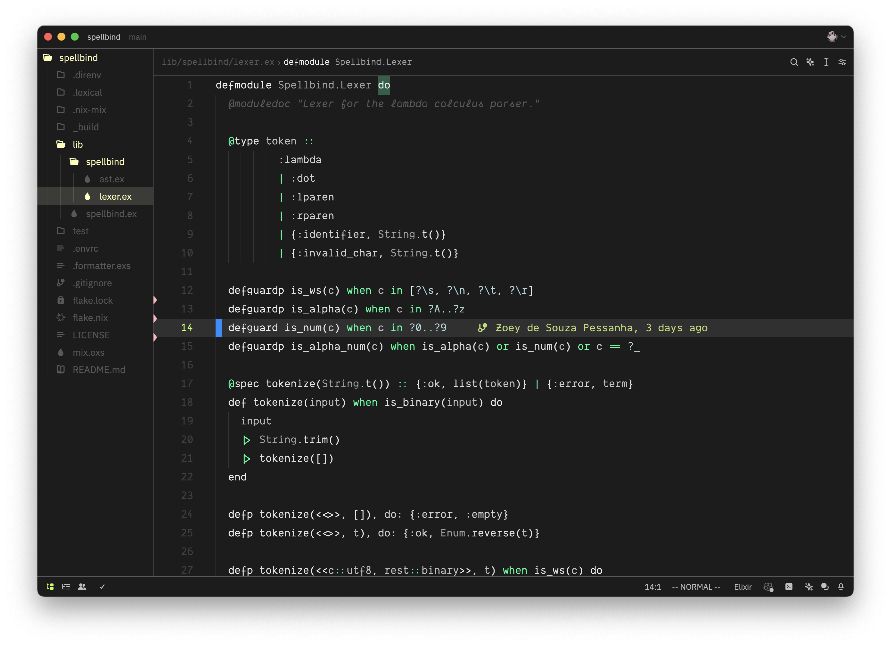

# darkvoid (zed)



## Configuration

place the `darkvoid.json` file to your zed themes folder, generally `$XDG_CONFIG/zed/themes`.

then you can issue the `cmd-k cmd-t` keyshort to open the theme switcher and select "Dark Void" or set

```json
# $XDG_CONFIG/zed/settings.json
{
  theme = "Dark Void"
}
```

to your zed `settings.json` file.

be darky and happy (:

## Thanks

- [darkvoid.nvim](https://github.com/Aliqyan-21/darkvoid.nvim)

## License

darkvoid is licensed under the MIT License.
